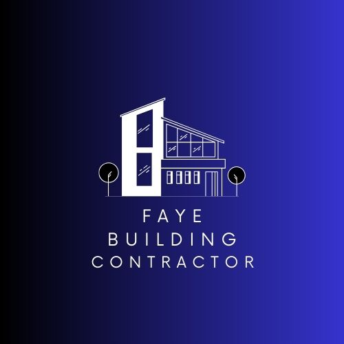

<!DOCTYPE html>
<html lang="fr">
<head>
    <meta charset="UTF-8">
    <meta name="viewport" content="width=device-width, initial-scale=1.0">
    <title>FAYE Building Contractor - Architecte Ibrahima FAYE</title>
    
    <link rel="stylesheet" href="https://cdnjs.cloudflare.com/ajax/libs/font-awesome/6.0.0-beta3/css/all.min.css">
</head>
<body>
    <header>
        

            

                
                
                

                    <h1>FAYE Building Contractor</h1>
                    
Architecture & Construction

                

            

            <nav>
                <ul>
                    <li><a href="#home">Accueil</a></li>
                    <li><a href="#services">Services</a></li>
                    <li><a href="#projects">Projets</a></li>
                    <li><a href="#contact">Contact</a></li>
                </ul>
            </nav>
        

    </header>

    <section id="home" class="hero">
        

            

                <h2>Conceptions Architecturales Exceptionnelles</h2>
                
Ibrahima FAYE, architecte principal avec plus de 20 ans d'expérience dans la création de bâtiments innovants et durables qui allient esthétique et fonctionnalité.

                <a href="#contact" class="btn">Demander un devis</a>
                <a href="#projects" class="btn btn-outline">Voir nos projets</a>
            

        

    </section>

    <section id="services" class="services">
        

            

                <h2>Nos Services</h2>
            

            

                

                    <i class="fas fa-drafting-compass"></i>
                    <h3>Conception Architecturale</h3>
                    
Création de plans sur mesure répondant à vos besoins spécifiques tout en respectant les normes de construction.

                

                

                    <i class="fas fa-home"></i>
                    <h3>Construction Résidentielle</h3>
                    
Réalisation de maisons individuelles, villas et résidences de qualité avec des matériaux haut de gamme.

                

                

                    <i class="fas fa-building"></i>
                    <h3>Bâtiments Commerciaux</h3>
                    
Conception et construction d'espaces commerciaux fonctionnels et attractifs pour votre entreprise.

                

                

                    <i class="fas fa-sync-alt"></i>
                    <h3>Rénovation</h3>
                    
Transformation et modernisation de bâtiments existants pour améliorer leur valeur et leur fonctionnalité.

                

                

                    <i class="fas fa-lightbulb"></i>
                    <h3>Conseil en Design</h3>
                    
Expertise en aménagement intérieur et sélection de matériaux pour un résultat harmonieux et durable.

                

                

                    <i class="fas fa-check-circle"></i>
                    <h3>Gestion de Projet</h3>
                    
Supervision complète du projet du concept à la réalisation finale, garantissant qualité et respect des délais.

                

            

        

    </section>

    <section id="projects" class="projects">
        

            

                <h2>Nos Réalisations</h2>
            

            

                

                    
                    

                        <h3>Résidence Les Palmiers</h3>
                        
Dakar, Sénégal

                    

                

                

                    
                    

                        <h3>Centre Commercial Zenith</h3>
                        
Bamako, Mali

                    

                

                

                    
                    

                        <h3>Rénovation Hôtel Savana</h3>
                        
Abidjan, Côte d'Ivoire

                    

                

            

        

    </section>

    <section id="contact" class="contact">
        

            

                <h2>Contactez-nous</h2>
            

            

                

                    

                        <h3>Coordonnées</h3>
                        
<i class="fas fa-user"></i> Ibrahima FAYE

                        
<i class="fas fa-briefcase"></i> Architecte Principal

                        
<i class="fas fa-phone"></i> +220 777 6563

                        
<i class="fas fa-phone"></i> +220 990 6563

                        
<i class="fas fa-phone"></i> +220 390 6563

                        
<i class="fas fa-phone"></i> +221 77 195 54 60

                        
<i class="fas fa-envelope"></i> <a href="mailto:faye1965ibrahima@gmail.com">faye1965ibrahima@gmail.com</a>

                    

                    

                        <h3>Heures d'ouverture</h3>
                        
Lundi - Jeudi: 11h00 - 18h00

                        
Samedi - Dimanche: 13h00 - 17h00

                        
Vendredi: Fermé

                    

                

                

                    <form>
                        <input type="text" placeholder="Votre nom" required>
                        <input type="email" placeholder="Votre email" required>
                        <input type="tel" placeholder="Votre téléphone">
                        <textarea placeholder="Votre message" required></textarea>
                        <button type="submit" class="btn">Envoyer le message</button>
                    </form>
                

            

        

    </section>

    <footer>
        

            

                
                

                    <h1 style="font-size: 1.2rem;">FAYE Building Contractor</h1>
                

            

            
© 2025 FAYE Building Contractor. Tous droits réservés.

            

    </footer>

    <!-- Bouton WhatsApp flottant -->
    <a href="https://wa.me/2207776563" class="whatsapp-float" target="_blank">
        <i class="fab fa-whatsapp"></i>
    </a>

    
</body>
</html>
